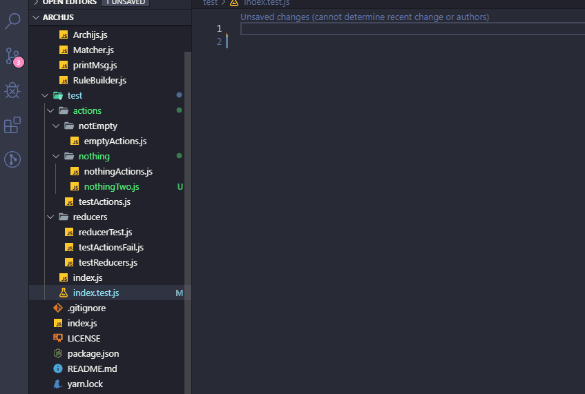

[](https://coveralls.io/github/migh1/archijs)


# archijs

A package to test javascript architecture

## Usage

```bash
yarn add archijs
```

```javascript
import Archijs from "archijs";

describe("Javascript Architecture", () => {
  it("Should have fileName according to folderName", () => {
    const project = Archijs.parseFromPath("src");
    
    const rule = Archijs
      .defineThat()
      .folder()
      .withNameMatching('actions')
      .should()
      .matchChildrensName('actions')

    expect(project).toMatchArch(rule);
  });
});
```

## Demo



## Todo

- [x] Fix async issue on chained functions.
- [x] Implement @types/jest.
- [x] Remove async/await on test using
- [x] Remove Babel
- [x] Add exceptions validation.
- [x] Improve unit tests coverage.
- [ ] Implement feature to read file content and validates the functions names.
- [ ] Improve dir name validation.

## Suggestions

- Please any suggestion you are invited to open an issue: https://github.com/migh1/archijs/issues
- You also can fork this project to contribute 

